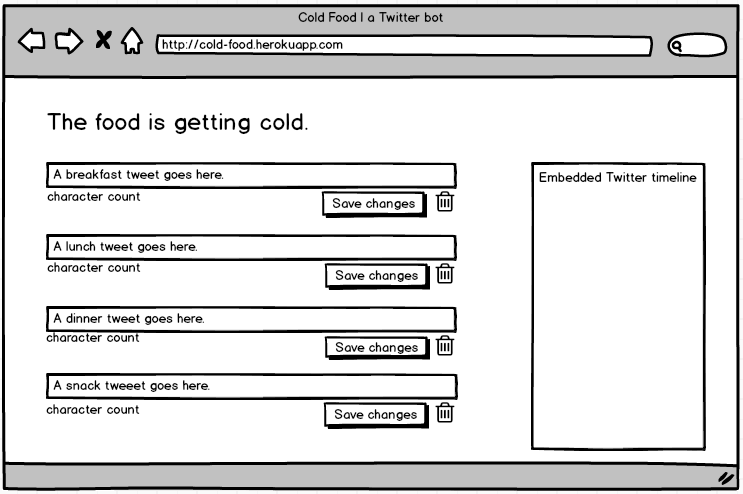

## @coldfoodbot (Cold Food Bot)

###A Twitter bot tweeting century-old meals, three times a day. Data comes from @nypl's ['What's on the Menu?'](http://menus.nypl.org/) collection. Runs off a custom Twitter dashboard on Heroku.

---

[Twitter](twitter.com/coldfoodbot)

[GitHub](https://github.com/mbd-s/cold-food)

---

####Technologies

JavaScript

Node.js

Angular

Express

MongoDB

Mongoose

Bootstrap

Heroku

---

####Instructions

To run your own bot, start by cloning this repo and installing the dependencies:

`$ npm install`

 You'll need to get your own keys to connect to Twitter. Sign up for a new Twitter account and [register an app](https://dev.twitter.com/) for it. Click the "Keys and Access Tokens" tab and click "Generate Consumer Key and Secret." Note your Consumer Key, Consumer Secret, Access Token, and Access Token Secret—you'll need to replace the placeholders in `config.js` with these. (Make sure to hide them if you're using GitHub.) To run the bot:

`$ node bot.js`

To run the

**Dependencies:**

node

npm

babyparse

body-parser

connect-wwwhisper

cron

dotenv

ejs

express

mongoose

twit

---

####User stories

Anyone interested in what people ate 100 years ago can follow @coldfoodbot on Twitter. The admin (OK, me) can edit scheduled tweets from the dashboard.

---

####Dashboard wireframe

---

####Planned features

Persona, which wwwhisper runs on, is shutting down 30. November.  Wwwhisper plans to migrate to a different service, but an alternative auth solution should be considered before then.

Seeding new tweets from the view.

Sending snack tweets from the view.

Multiple-day schedule view.

Images of menus in tweets and association of dishes with menus (both depend on getting an API token).

---

Favicon by Luis Prado, licensed under [Creative Commons](http://creativecommons.org/licenses/by/3.0/us/).
